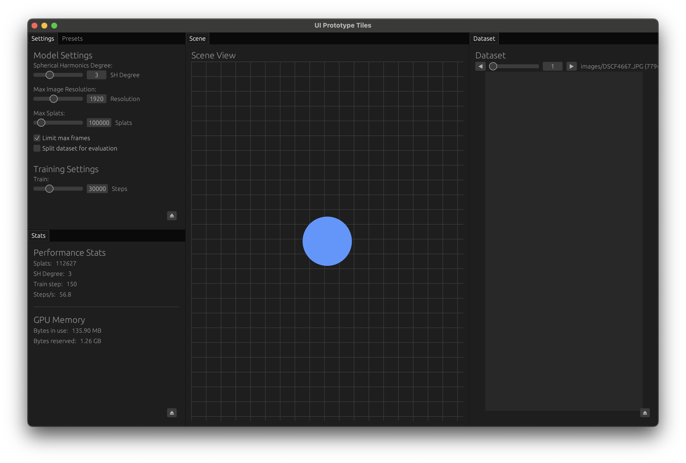
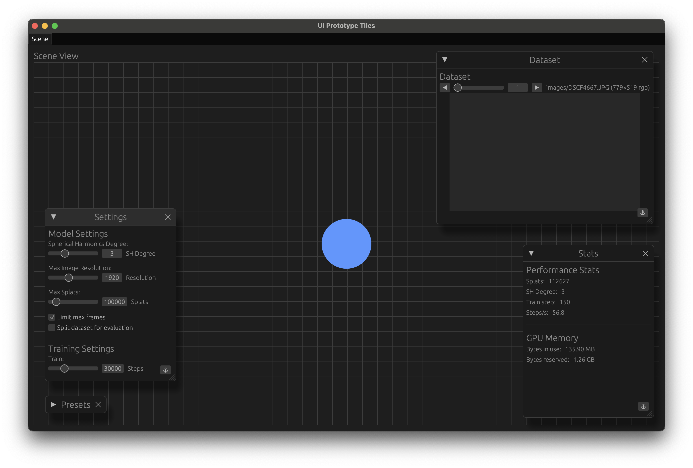

# Brush egui_tiles Prototype

This project is an experiment exploring UI/UX options for the main [Brush application](https://github.com/arthurbrussee/brush) using `egui` and the `egui_tiles` crate.

The primary goal is to validate the implementation of a hybrid interface combining dockable tiled panels with free-floating windows, allowing panels to move between these states.

For detailed technical notes, implementation strategies, and lessons learned, please see the [EGUI_TILES_PLAN.md](EGUI_TILES_PLAN.md) file.

## Scope & Limitations

This prototype focuses **exclusively on the UI/UX experiment** for docking, undocking, floating, closing, and reopening panels. It **does not replicate the actual functionality** of the panels found in the Brush application.

Integrating these UI patterns into the main Brush app would require significant refactoring within Brush, particularly moving core processing logic out of individual panel code and into background processes/threads to support a more modular and flexible UI state.

## Current State

The prototype successfully demonstrates:
*   An initial layout mimicking the Brush application using `egui_tiles`.
*   Undocking panels from the main tiled layout into separate, resizable floating windows via a button click.
*   Docking floating windows back into the main layout via a button click.
*   Closing floating windows.

**Initial Layout:**

*Shows the application on launch, with panels arranged in a docked configuration similar to Brush.* 

**Floating Windows:**

*Shows multiple panels undocked and rearranged as floating windows.* 

## TODO / Next Steps

Key remaining items include:

*   Implementing the ability to close *docked* panels.
*   Adding a menu or mechanism to reopen closed panels.
*   Refining the docking logic (e.g., target selection).
*   Investigating layout persistence between sessions.
*   Addressing minor visual glitches (button layering, resize behavior at very small sizes).

See the [plan file](EGUI_TILES_PLAN.md) for a full list.

## Feedback

Findings and feedback will be shared on the Brush Discord server.

## Attribution

This prototype was built by Ryan Hickman (former Google TPM) as a "vibe coding" experiment using [Cursor](https://cursor.sh/) with Gemini 2.5 Pro. 